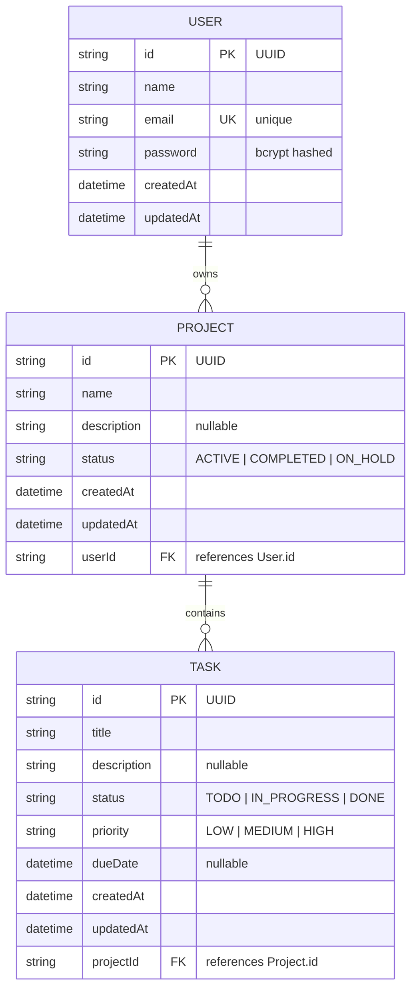

# 🚀 Project Management System

A **full-stack project management application** with a shared REST API backend, a responsive web frontend, and a cross-platform mobile app. Built as a Full-Stack Developer Intern assessment.

---

## 📋 Table of Contents

- [Architecture Overview](#architecture-overview)
- [Tech Stack](#tech-stack)
- [What Has Been Completed](#what-has-been-completed)
- [What Remains To Be Done](#what-remains-to-be-done)
- [Project Structure](#project-structure)
- [Setup Instructions](#setup-instructions)
- [API Endpoints](#api-endpoints)
- [Database Schema (ER Diagram)](#database-schema-er-diagram)
- [Demo Credentials](#demo-credentials)
- [Environment Variables](#environment-variables)
- [Final End Goal](#final-end-goal)

---

## Architecture Overview

```
┌─────────────────┐     ┌─────────────────┐     ┌─────────────────┐
│   Web Frontend  │     │  Mobile App     │     │  Swagger Docs   │
│  React + Vite   │     │  React Native   │     │  /api/docs      │
│  Port 5173      │     │  Expo (SDK 51)  │     │                 │
└────────┬────────┘     └────────┬────────┘     └────────┬────────┘
         │                       │                       │
         └───────────┬───────────┴───────────────────────┘
                     │
              ┌──────▼──────┐
              │  REST API   │
              │  Express.js │
              │  Port 5000  │
              └──────┬──────┘
                     │
              ┌──────▼──────┐
              │   SQLite    │
              │   (Prisma)  │
              │   dev.db    │
              └─────────────┘
```

---

## Tech Stack

| Layer      | Technology                                                      |
| ---------- | --------------------------------------------------------------- |
| **Backend**  | Node.js, Express 5, TypeScript, Prisma ORM (v5.22), SQLite     |
| **Web**      | React 18, Vite, Tailwind CSS, Axios, React Router v6           |
| **Mobile**   | React Native (Expo SDK 51), React Navigation, Axios            |
| **Auth**     | JWT (JSON Web Tokens), bcrypt password hashing                  |
| **Validation** | Zod schema validation                                        |
| **Docs**     | Swagger UI (OpenAPI 3.0)                                        |
| **Testing**  | Jest + Supertest (16 integration tests)                         |

---

## ✅ What Has Been Completed

### Backend REST API — **100% Complete & Tested**

- [x] Express.js server with TypeScript
- [x] Prisma ORM with SQLite database
- [x] **14 API endpoints** covering Auth, Projects, Tasks, and Dashboard
- [x] JWT-based authentication with bcrypt password hashing
- [x] Zod input validation on all endpoints
- [x] Rate limiting on auth routes (brute-force protection)
- [x] User-level authorization (users can only see/modify their own data)
- [x] Swagger/OpenAPI documentation at `/api/docs`
- [x] Centralized error handling middleware
- [x] Database seeded with demo data (4 projects, multiple tasks)
- [x] **16/16 Jest integration tests passing**
- [x] TypeScript build passes (`npm run build`)
- [x] Dockerfile and docker-compose.yml created

### Web Frontend — **~95% Complete (builds successfully)**

- [x] React 18 + Vite + Tailwind CSS setup
- [x] **Login page** with form validation & error handling
- [x] **Register page** with password confirmation
- [x] **Dashboard page** — 5 KPI cards (Total Projects, Total Tasks, Completed, In Progress, Completion %) + progress bar
- [x] **Projects page** — grid view, search bar, status filter, create/edit/delete via modal
- [x] **Project Details page** — task list, progress bar, add/edit task modal, toggle task status
- [x] **Tasks page** — all-tasks view with status/priority/project filters, create/edit/delete via modal
- [x] Auth context with localStorage token persistence & session expiry redirect
- [x] Responsive Navbar + Sidebar layout
- [x] Reusable components: Badge, Modal, LoadingSpinner
- [x] API client with JWT interceptor
- [x] `npm run build` passes successfully (verified)

### Mobile App — **~70% Complete (code written, not wired up)**

- [x] Expo SDK 51 project initialized, dependencies installed
- [x] **LoginScreen** — email/password form, demo autofill button, backend IP configurator
- [x] **RegisterScreen** — registration form with validation
- [x] **DashboardScreen** — 5 KPI cards, progress bar, pull-to-refresh
- [x] **ProjectsScreen** — search, status filter pills, create modal, pull-to-refresh
- [x] **ProjectDetailsScreen** — task list, progress bar, add task modal, toggle status
- [x] **TasksScreen** — search, status/priority filters, create/edit modal, pull-to-refresh
- [x] AuthContext with SecureStore token persistence
- [x] API client with Keystore token injection & network error detection
- [x] Reusable components: Badge, NetworkBanner
- [x] TypeScript type definitions

---

## ❌ What Remains To Be Done

### Mobile App — Wiring & Testing

- [ ] **`App.tsx`** — Main entry point with React Navigation (Auth stack → Bottom Tab navigator for Dashboard/Projects/Tasks)
- [ ] **`babel.config.js`** — Standard Expo Babel configuration
- [ ] **Assets folder** — `icon.png`, `splash.png`, `favicon.png` placeholders
- [ ] **Test on device/emulator** — Run with Expo Go and verify all screens

### Integration Testing

- [ ] **Run web + backend together** in dev mode (`npm run dev` on both) and verify end-to-end
- [ ] **Run mobile + backend together** — test on physical device with Expo Go
- [ ] **Cross-platform testing** — verify on both Android and iOS (if Mac available)

### Git & Deployment

- [ ] **Initialize Git repository** with proper `.gitignore`
- [ ] **Push to GitHub** (public or private repo)

### Documentation & Deliverables

- [ ] **ER Diagram** — visual Mermaid diagram (schema exists below)
- [ ] **Demo video** — record a walkthrough showing all features
- [ ] **Deployment guide** — instructions for production deployment

---

## Project Structure

```
project-management-system/
├── README.md                    ← You are here
├── docker-compose.yml           ← Docker Compose for containerized deployment
│
├── backend/                     ← REST API (Express + TypeScript + Prisma)
│   ├── package.json
│   ├── tsconfig.json
│   ├── tsconfig.build.json
│   ├── jest.config.js
│   ├── Dockerfile
│   ├── .env                     ← Environment variables
│   ├── .env.example
│   ├── prisma/
│   │   ├── schema.prisma        ← Database schema (User, Project, Task)
│   │   ├── seed.ts              ← Demo data seeder
│   │   └── dev.db               ← SQLite database file
│   ├── src/
│   │   ├── index.ts             ← Server entrypoint
│   │   ├── app.ts               ← Express app setup
│   │   ├── config/index.ts      ← Environment config
│   │   ├── db/prisma.ts         ← Prisma client singleton
│   │   ├── types/index.ts       ← TypeScript interfaces
│   │   ├── middleware/           ← auth, validate, rateLimiter, errorHandler
│   │   ├── schemas/             ← Zod validation schemas
│   │   ├── controllers/         ← Route handlers
│   │   ├── routes/              ← Express route definitions
│   │   └── docs/swagger.ts      ← OpenAPI spec + Swagger UI
│   └── tests/
│       └── api.test.ts          ← 16 integration tests
│
├── web/                         ← Web Frontend (React + Vite + Tailwind)
│   ├── package.json
│   ├── vite.config.ts
│   ├── tailwind.config.js
│   ├── postcss.config.js
│   ├── index.html
│   └── src/
│       ├── main.tsx             ← React root
│       ├── App.tsx              ← Routes + ProtectedLayout
│       ├── index.css            ← Tailwind directives
│       ├── types/index.ts
│       ├── api/client.ts        ← Axios with JWT interceptor
│       ├── context/AuthContext.tsx
│       ├── components/          ← Badge, LoadingSpinner, Modal, Navbar, Sidebar
│       └── pages/               ← Login, Register, Dashboard, Projects, ProjectDetail, Tasks
│
└── mobile/                      ← Mobile App (React Native + Expo)
    ├── package.json
    ├── app.json
    ├── tsconfig.json
    ├── App.tsx                  ← ⚠️ NOT YET CREATED (next step)
    ├── babel.config.js          ← ⚠️ NOT YET CREATED (next step)
    └── src/
        ├── types/index.ts
        ├── storage/secureStore.ts
        ├── api/client.ts
        ├── context/AuthContext.tsx
        ├── components/          ← Badge, NetworkBanner
        └── screens/             ← Login, Register, Dashboard, Projects, ProjectDetails, Tasks
```

---

## Setup Instructions

### Prerequisites

- **Node.js** v18+ (v24.20.0 is installed on the dev machine)
- **npm** v9+ (v11.19.0 is installed)
- **Expo Go** app on your phone (for mobile testing)

### 1. Backend Setup

```bash
cd backend

# Install dependencies
npm install

# Generate Prisma client
npx prisma generate

# Create/migrate database
npx prisma db push

# Seed demo data
npx prisma db seed

# Start development server
npm run dev
# → Server runs on http://localhost:5000
# → Swagger docs at http://localhost:5000/api/docs
```

### 2. Web Frontend Setup

```bash
cd web

# Install dependencies
npm install

# Start development server
npm run dev
# → App runs on http://localhost:5173

# Build for production
npm run build
```

### 3. Mobile App Setup

```bash
cd mobile

# Install dependencies
npm install --legacy-peer-deps

# Start Expo development server
npx expo start
# → Scan QR code with Expo Go app on your phone
# → Make sure phone and computer are on the same Wi-Fi network
```

> **Note:** On the mobile login screen, tap the settings icon to configure the backend IP address. Use your computer's LAN IP (shown in the backend terminal output) instead of `localhost`.

---

## API Endpoints

### Authentication

| Method | Endpoint             | Description              | Auth |
| ------ | -------------------- | ------------------------ | ---- |
| POST   | `/api/auth/register` | Register a new user      | ❌   |
| POST   | `/api/auth/login`    | Login & get JWT token    | ❌   |
| POST   | `/api/auth/logout`   | Logout (client-side)     | ✅   |
| GET    | `/api/auth/me`       | Get current user profile | ✅   |

### Projects

| Method | Endpoint             | Description          | Auth |
| ------ | -------------------- | -------------------- | ---- |
| GET    | `/api/projects`      | List all projects    | ✅   |
| GET    | `/api/projects/:id`  | Get project details  | ✅   |
| POST   | `/api/projects`      | Create new project   | ✅   |
| PUT    | `/api/projects/:id`  | Update project       | ✅   |
| DELETE | `/api/projects/:id`  | Delete project       | ✅   |

### Tasks

| Method | Endpoint          | Description       | Auth |
| ------ | ----------------- | ----------------- | ---- |
| GET    | `/api/tasks`      | List all tasks    | ✅   |
| GET    | `/api/tasks/:id`  | Get task details  | ✅   |
| POST   | `/api/tasks`      | Create new task   | ✅   |
| PUT    | `/api/tasks/:id`  | Update task       | ✅   |
| DELETE | `/api/tasks/:id`  | Delete task       | ✅   |

### Dashboard

| Method | Endpoint         | Description                                    | Auth |
| ------ | ---------------- | ---------------------------------------------- | ---- |
| GET    | `/api/dashboard` | Get dashboard metrics (5 KPIs + project stats) | ✅   |

---

## Database Schema (ER Diagram)



---

## Demo Credentials

| Email              | Password      | User Name   |
| ------------------ | ------------- | ----------- |
| demo@example.com   | password123   | Alex Morgan |

The demo account comes pre-seeded with **4 projects** and multiple tasks across different statuses and priorities.

---

## Environment Variables

### Backend (`backend/.env`)

```env
PORT=5000
DATABASE_URL="file:./dev.db"
JWT_SECRET="your-super-secret-jwt-key-change-in-production"
JWT_EXPIRES_IN="7d"
NODE_ENV="development"
```

> ⚠️ **Important:** Change `JWT_SECRET` to a strong random string for production.

---

## Where to Continue From

### Immediate Next Steps (in order):

1. **Create `mobile/App.tsx`** — Wire up React Navigation with:
   - Auth Stack (Login → Register)
   - Main Bottom Tab Navigator (Dashboard, Projects, Tasks)
   - Navigation from Projects to ProjectDetails

2. **Create `mobile/babel.config.js`** — Standard Expo babel config

3. **Add placeholder assets** — `mobile/assets/icon.png`, `splash.png`, `favicon.png`

4. **Test end-to-end:**
   - Start backend: `cd backend && npm run dev`
   - Start web: `cd web && npm run dev`
   - Open http://localhost:5173, login with demo credentials
   - Start mobile: `cd mobile && npx expo start`
   - Open Expo Go on phone, configure backend IP, login

5. **Initialize Git:**
   ```bash
   git init
   echo "node_modules/\ndist/\n*.db\n.env\n.expo/" > .gitignore
   git add .
   git commit -m "Initial commit: Full-stack project management system"
   ```

6. **Record demo video** showing all CRUD operations on web and mobile

---

## Final End Goal

As per the **Full-Stack Developer Intern Assessment**, the final deliverable is:

> A **complete project management tool** with:
> - ✅ A shared **REST API backend** (Node.js + Express + Prisma) with JWT auth
> - ✅ A responsive **web application** (React) for desktop/laptop use
> - 🔧 A cross-platform **mobile application** (React Native / Expo) for on-the-go access
> - ✅ Full **CRUD operations** for Projects and Tasks
> - ✅ **Dashboard** with 5 key performance metrics
> - ✅ **User authentication** with secure token management
> - ✅ **API documentation** via Swagger
> - ✅ **Input validation** and error handling
> - ✅ **Integration tests** (16 passing)

### Submission Requirements:
1. **GitHub Repository** — Push code with this README
2. **Demo Video** — Record a walkthrough showing all features
3. *(Optional)* **Live Deployment** — Deploy backend + web to a cloud provider

---

## 🛠️ Development Notes

- **Prisma version pinned to v5.22.0** — Do NOT upgrade to v8 (breaking changes)
- **SQLite used for zero-friction setup** — No need to install PostgreSQL/MySQL
- **`--legacy-peer-deps`** required for mobile `npm install` due to Expo peer dependency conflicts
- **Backend auto-detects LAN IP** — Shown in terminal output for mobile device connection

---

## License

This project was built as part of a Full-Stack Developer Intern Assessment.
